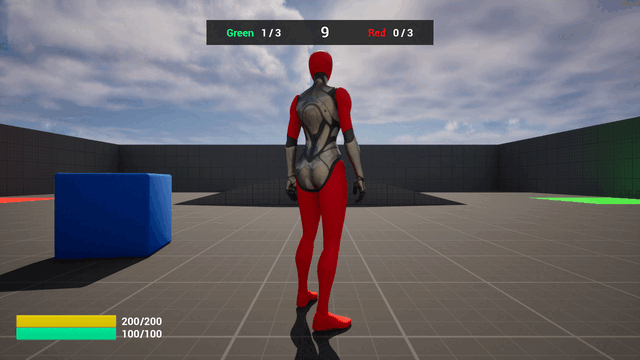
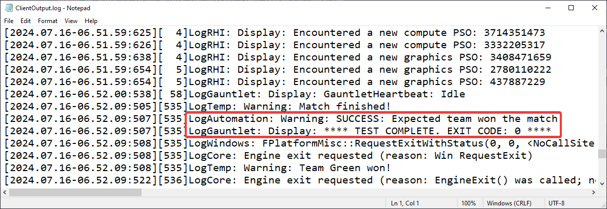

# Unreal Engine Automated Test Project

This is the Automation Project developed and configured for the Unreal Engine Project [UE5_CaptureTheFlag](https://github.com/Narsell/UE5_CaptureTheFlag)

This project is set up by using the UAT (Unreal Automation Tool) to generate the necessary files and configurations and run the UAT scripts that allow an unreal session to be started from a package build.

The runtime test execution hooks up to a [UGauntletTestController-implemented child class](https://github.com/Narsell/UE5_CaptureTheFlag/tree/main/Source/CaptureTheFlag/AutomationTests) which puppeteers the state of the game and evaluates the desired conditions to determine the outcome of the test.

When the test finishes execution, it generates test artifacts which can be used as evidence or additional information on the outcome.
The test artifacts consist mainly of the log of the build's runtime executable (in this case, the client executable) and a series of screenshots which are also presented in a GIF format as seen below.

---

### Test Cases contained
* **Title:** The team with highest score should win when the initial timer runs out 
**Summary:** This test case tests the scenario where one of teams is ahead in score (1 to 0) before the initial timer reaches 0. Once the timer ends, the team who is ahead should win the match. 
**Steps to reproduce:**
    * Given the map has loaded and the match has started
    * When Team A scores a point
    * Then Team A should win the match once the match timer ends

  **Test Artifacts:**
    * GIF generated showing the test execution 
      
    * Runtime executable log 
      

